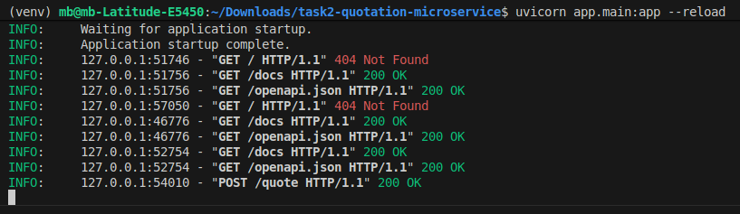
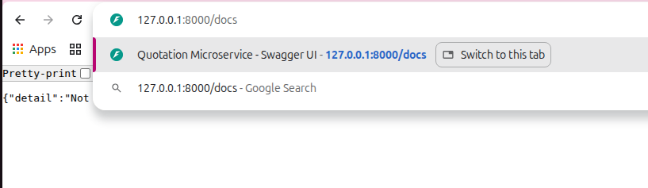
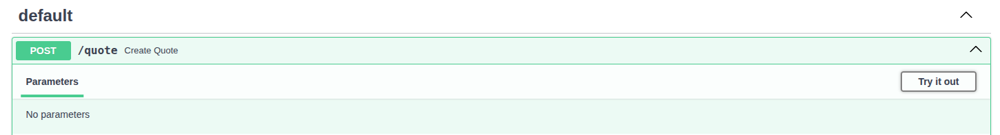
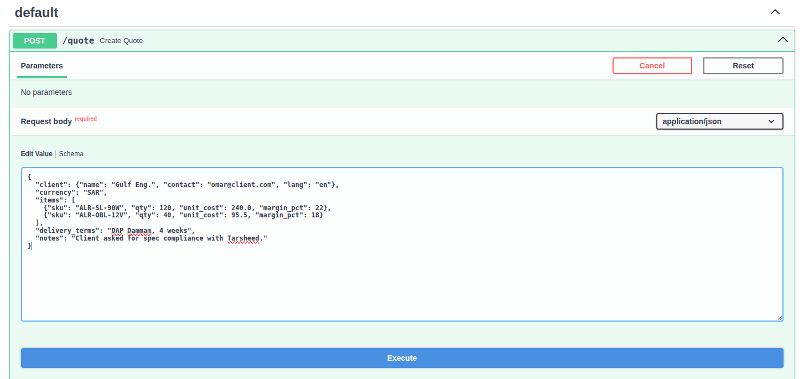
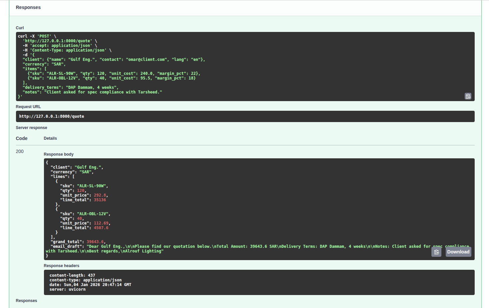

# Quotation Microservice (Python + OpenAI)

## Description
This project is a Quotation Microservice built with FastAPI in Python. It calculates item prices with margins, totals, and generates ready-to-send quotation emails in English or Arabic. The service is lightweight, testable, and can run locally without connecting to OpenAI, using mocked LLM responses.

## Project Objective

* Provide a simple API (POST /quote) to generate quotations automatically.
* Calculate line totals and grand total based on quantity, unit cost, and margin.
* Generate email drafts summarizing totals, delivery terms, and client notes in the requested language.
* Include testing (pytest), Docker support, and OpenAPI docs for easy deployment.

## Dataset Story

* The microservice takes a JSON payload with:
* client: Name, contact, language (en/ar)
* currency: Pricing currency (e.g., SAR)
* items: List of products, each with SKU, quantity, unit cost, and margin %
* delivery_terms: Shipping info
* notes: Optional client instructions


## The service calculates:

```bash
  line_total = unit_cost * (1 + margin_pct/100) * qty
```
It returns: line totals, grand total, and a formatted email draft.

### Example Input:

```bash
{
  "client": {"name": "Gulf Eng.", "contact": "omar@client.com", "lang": "en"},
  "currency": "SAR",
  "items": [
    {"sku": "ALR-SL-90W", "qty": 120, "unit_cost": 240.0, "margin_pct": 22},
    {"sku": "ALR-OBL-12V", "qty": 40, "unit_cost": 95.5, "margin_pct": 18}
  ],
  "delivery_terms": "DAP Dammam, 4 weeks",
  "notes": "Client asked for spec compliance with Tarsheed."
}
```

## Setup

### Install Python 3.10+

### Create and activate a virtual environment:

```bash
python -m venv venv
source venv/bin/activate      # Linux/Mac
venv\Scripts\activate         # Windows 
```
### Install dependencies:
```bash
pip install -r requirements.txt
```

### Run the FastAPI application:
```bash
uvicorn app.main:app --reload
```
### Once the server starts, check the terminal for the local URL, usually:
```bash
http://127.0.0.1:8000
```


### Open this URL in your browser (Chrome recommended).

### To access the API documentation, navigate to:
```bash
http://127.0.0.1:8000/docs
```


### This will open the Swagger UI, where you can explore and test your API endpoints interactively.

### In the Swagger UI (/docs), find the default section (the endpoint /quote).

### Click on it to expand the endpoint details.

### Click on “Try it out” to enable editing of the input parameters.



### Edit the JSON values as needed (refer to the Example Input above) to test different clients, items, delivery terms, or notes.



### Click “Execute” to send the request to the server.

### The server response will appear below, showing:
- Line totals
- Grand total
- Email draft

### You can download the response if needed for further use or testing.




    